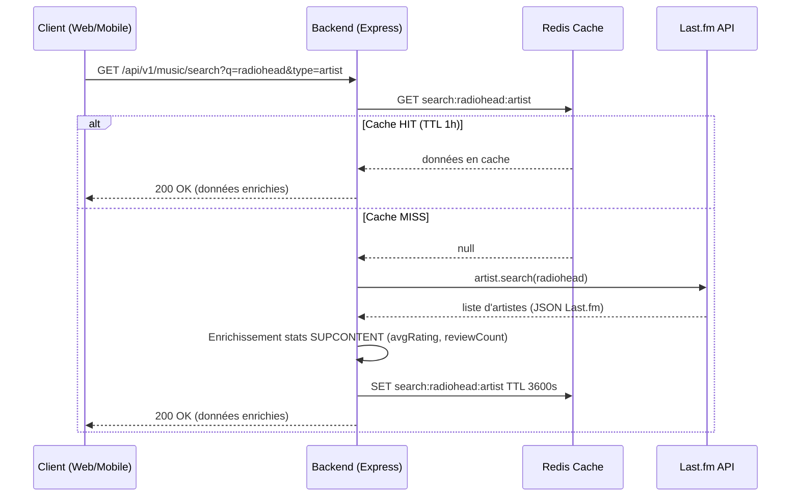

# SUPCONTENT

**L'Instagram de la Musique** — réseau social centré sur la découverte, la notation et le partage musical.

Projet académique 3PROJ (2024-2025).

## Fonctionnalités

- **Authentification** : inscription email/password + OAuth Google et GitHub, sessions JWT (15 min) + refresh token httpOnly (30 j)
- **Recherche musicale** : artistes, albums, titres via Last.fm — fiches enrichies (bio, albums, similarités, pochettes)
- **Bibliothèque personnelle** : statuts (À écouter / En cours / Terminé / Abandonné), notation 1-5, notes privées
- **Listes** : listes publiques ou privées d'artistes / albums / titres
- **Critiques** : 10-5000 caractères, notation, likes, commentaires, signalement, mise en avant admin
- **Feed** : activité de ses abonnements en temps réel (Socket.io) + fil découverte public
- **Messagerie privée** : temps réel (Socket.io), indicateur de saisie, entre followers mutuels uniquement
- **Notifications** : likes, commentaires, nouveaux abonnés — configurable et en temps réel
- **Player YouTube** : lecture d'extraits via l'iframe API, videoId résolu côté serveur
- **Classements** : top artistes et titres Last.fm
- **Admin** : gestion des signalements, mise en avant de critiques, ban/unban utilisateurs
- **Export RGPD** : profil + bibliothèque + critiques + messages + listes en JSON ou CSV (1×/24 h)
- **Application mobile** : Expo (React Native) — feed, recherche, profil, bibliothèque, notifications, chat, détail œuvres

## Stack

| Brique    | Technologies                                                                   |
| --------- | ------------------------------------------------------------------------------ |
| Backend   | Node.js 20, TypeScript strict, Express, Prisma 5, PostgreSQL 15, Redis 7, Socket.io |
| Frontend  | React 18 + Vite, React Router, react-i18next (fr/en), Socket.io client, Lucide |
| Mobile    | React Native / Expo                                                            |
| APIs      | Last.fm (métadonnées), YouTube Data v3 (videoId)                              |

Les clients ne contactent **jamais** les APIs tierces directement : tout passe par le backend.

## Démarrage rapide (Docker)

```bash
cp .env.example .env
# Éditer .env : LASTFM_API_KEY, YOUTUBE_API_KEY, JWT_SECRET, JWT_REFRESH_SECRET
docker compose up --build
```

- Frontend : http://localhost:5173
- Backend (API) : http://localhost:3000
- Swagger UI : http://localhost:3000/api-docs
- Postgres : localhost:5432 · Redis : localhost:6379

Les migrations Prisma s'exécutent automatiquement au démarrage du conteneur backend
(`prisma migrate deploy` dans le `CMD` du Dockerfile).

## Obtenir les clés API

### Last.fm API

1. Créer un compte sur [last.fm](https://www.last.fm/join)
2. Aller sur [last.fm/api/account/create](https://www.last.fm/api/account/create)
3. Remplir le formulaire (Application name : "SUPCONTENT", Application type : Desktop application)
4. Copier la **API key** → `LASTFM_API_KEY` dans `.env`
5. Copier le **Shared Secret** → `LASTFM_SECRET` dans `.env`

### YouTube Data API v3

1. Aller sur [console.cloud.google.com](https://console.cloud.google.com)
2. Créer un projet ou en sélectionner un existant
3. Menu → **APIs & Services** → **Library** → chercher "YouTube Data API v3" → **Enable**
4. Menu → **APIs & Services** → **Credentials** → **Create Credentials** → **API Key**
5. Copier la clé → `YOUTUBE_API_KEY` dans `.env`
6. (Recommandé) Restreindre la clé à l'API YouTube Data v3

### OAuth Google (optionnel)

1. Google Cloud Console → **APIs & Services** → **Credentials** → **Create Credentials** → **OAuth 2.0 Client ID**
2. Application type : **Web application**
3. Authorized redirect URI :
   - **Docker** : `http://localhost:5173/api/v1/auth/oauth/google/callback`
   - **Dev sans Docker** : `http://localhost:3000/api/v1/auth/oauth/google/callback`
4. Copier Client ID → `OAUTH_GOOGLE_CLIENT_ID` et Client Secret → `OAUTH_GOOGLE_CLIENT_SECRET`

> En Docker, nginx (port 5173) proxifie `/api/v1/…` vers le backend (port 3000).
> C'est pourquoi le `redirect_uri` doit utiliser le port 5173 et non 3000.

### OAuth GitHub (optionnel)

1. GitHub → **Settings** → **Developer settings** → **OAuth Apps** → **New OAuth App**
2. Homepage URL : `http://localhost:5173`
3. Authorization callback URL :
   - **Docker** : `http://localhost:5173/api/v1/auth/oauth/github/callback`
   - **Dev sans Docker** : `http://localhost:3000/api/v1/auth/oauth/github/callback`
4. Copier Client ID → `OAUTH_GITHUB_CLIENT_ID` et Client Secret → `OAUTH_GITHUB_CLIENT_SECRET`

## Architecture — Diagramme de séquence

Flux : recherche musicale avec mise en cache Redis.



## Développement local (hors Docker)

### Backend

```bash
cd app/backend
cp .env.example .env
# Adapter DATABASE_URL et REDIS_URL vers des instances locales
# Changer CLIENT_WEB_URL=http://localhost:5173 (ou port du frontend)
npm install
npx prisma generate
npx prisma migrate dev
npm run dev        # http://localhost:3000
npm test           # vitest
```

#### Données de test (seed)

Pour peupler la base avec des comptes et données de démonstration couvrant l'ensemble des fonctionnalités (follows, bibliothèque, listes, critiques, commentaires, likes, messages, notifications) :

```bash
cd app/backend
npx prisma db seed
```

Comptes créés (mot de passe commun : `Test1234!`) :

| Email                     | Rôle  | Particularité                          |
| -------------------------- | ----- | --------------------------------------- |
| `admin@supcontent.test`    | ADMIN | accès `/admin/*`                        |
| `alice@supcontent.test`    | USER  | suit/suivie par bob, bibliothèque, liste publique |
| `bob@supcontent.test`      | USER  | a posté une critique mise en avant      |
| `carol@supcontent.test`    | USER  | a liké la critique de bob               |
| `banned@supcontent.test`   | USER  | compte banni (`isBanned: true`)         |

### Frontend Web

```bash
cd app/frontend
npm install
npm run dev        # http://localhost:5173
npm test
```

### Mobile

```bash
cd app/mobile
npm install
# Générer les icônes brand (ne nécessite aucune dépendance externe)
node generate-icons.js
npx expo start
```

## Structure

```
SUPCONTENT/
├── app/
│   ├── backend/     # API REST + WebSocket + proxy Last.fm/YouTube
│   ├── frontend/    # Client web React
│   └── mobile/      # Client mobile Expo
├── docs/            # Documentation technique + manuel utilisateur
├── docker-compose.yml
├── .env.example
└── README.md
```

## Documentation

- [`docs/DOCUMENTATION_TECHNIQUE.md`](docs/DOCUMENTATION_TECHNIQUE.md) — architecture détaillée, design system, i18n, sécurité
- [`docs/MANUEL_UTILISATEUR.md`](docs/MANUEL_UTILISATEUR.md) — guide utilisateur complet
- Swagger UI : http://localhost:3000/api-docs (dev uniquement)

## Tests

- **Backend** : `cd app/backend && npm test` — vitest (utils, middlewares, services)
- **Frontend** : `cd app/frontend && npm test` — vitest + React Testing Library

## Variables d'environnement requises

Voir `.env.example` pour la liste complète. Les variables obligatoires :

| Variable              | Description                                  |
| --------------------- | -------------------------------------------- |
| `DATABASE_URL`        | Chaîne de connexion PostgreSQL               |
| `REDIS_URL`           | URL Redis                                    |
| `JWT_SECRET`          | Secret de signature des access tokens        |
| `JWT_REFRESH_SECRET`  | Secret de signature des refresh tokens       |
| `LASTFM_API_KEY`      | Clé API Last.fm                              |
| `YOUTUBE_API_KEY`     | Clé API YouTube Data v3                      |
| `CLIENT_WEB_URL`      | URL publique du frontend (ex: `http://localhost:5173`) |

Variables optionnelles : `OAUTH_GOOGLE_CLIENT_ID`, `OAUTH_GOOGLE_CLIENT_SECRET`,
`OAUTH_GITHUB_CLIENT_ID`, `OAUTH_GITHUB_CLIENT_SECRET` (OAuth désactivé si absent).

## Licence

Projet académique — tous droits réservés.
