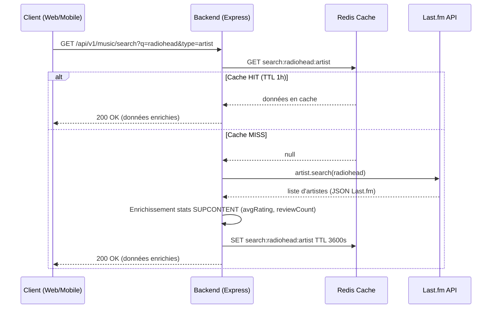

# SUPCONTENT

**L'Instagram de la Musique** — réseau social centré sur la découverte, la notation et le partage musical.

Projet académique 3PROJ (2024-2025).

## Stack

| Brique    | Technologies                                                  |
| --------- | ------------------------------------------------------------- |
| Backend   | Node.js 20, TypeScript, Express, Prisma, PostgreSQL 15, Redis 7, Socket.io |
| Frontend  | React 18 + Vite, React Router, Socket.io client, Lucide       |
| Mobile    | React Native / Expo                                            |
| APIs      | Last.fm (métadonnées), YouTube Data v3 (videoId)              |

Les clients ne contactent **jamais** les APIs tierces directement : tout passe par le backend.

## Démarrage rapide (Docker)

```bash
cp .env.example .env
# Éditer .env pour fournir LASTFM_API_KEY, YOUTUBE_API_KEY et les secrets JWT
docker compose up --build
```

- Backend : http://localhost:3000
- Frontend : http://localhost:5173
- Postgres : localhost:5432 · Redis : localhost:6379

Les migrations Prisma s'exécutent automatiquement au démarrage du conteneur backend
(`prisma migrate deploy` dans le `CMD` du Dockerfile).

## Obtenir les clés API

### Last.fm API

1. Créer un compte sur [last.fm](https://www.last.fm/join)
2. Aller sur [last.fm/api/account/create](https://www.last.fm/api/account/create)
3. Remplir le formulaire (Application name : "SUPCONTENT", Application type : Desktop application)
4. Copier la **API key** → `LASTFM_API_KEY` dans `.env`
5. Copier le **Shared Secret** → `LASTFM_SECRET` dans `.env`

### YouTube Data API v3

1. Aller sur [console.cloud.google.com](https://console.cloud.google.com)
2. Créer un projet ou en sélectionner un existant
3. Menu → **APIs & Services** → **Library** → chercher "YouTube Data API v3" → **Enable**
4. Menu → **APIs & Services** → **Credentials** → **Create Credentials** → **API Key**
5. Copier la clé → `YOUTUBE_API_KEY` dans `.env`
6. (Recommandé) Restreindre la clé à l'API YouTube Data v3

### OAuth Google (optionnel)

1. Google Cloud Console → **APIs & Services** → **Credentials** → **Create Credentials** → **OAuth 2.0 Client ID**
2. Application type : **Web application**
3. Authorized redirect URI : `http://localhost:3000/api/v1/auth/oauth/google/callback`
4. Copier Client ID → `OAUTH_GOOGLE_CLIENT_ID` et Client Secret → `OAUTH_GOOGLE_CLIENT_SECRET`

### OAuth GitHub (optionnel)

1. GitHub → **Settings** → **Developer settings** → **OAuth Apps** → **New OAuth App**
2. Homepage URL : `http://localhost:5173`
3. Authorization callback URL : `http://localhost:3000/api/v1/auth/oauth/github/callback`
4. Copier Client ID → `OAUTH_GITHUB_CLIENT_ID` et Client Secret → `OAUTH_GITHUB_CLIENT_SECRET`

## Architecture — Diagramme de séquence

Flux : recherche musicale avec mise en cache Redis.



## Développement local (hors Docker)

### Backend

```bash
cd app/backend
cp .env.example .env
npm install
npx prisma generate
npx prisma migrate dev
npm run dev        # http://localhost:3000
npm test           # vitest
```

### Frontend Web

```bash
cd app/frontend
cp .env.example .env
npm install
npm run dev        # http://localhost:5173
npm test
```

### Mobile

```bash
cd app/mobile
cp .env.example .env
npm install
npx expo start
```

## Structure

```
SUPCONTENT/
├── app/
│   ├── backend/     # API REST + WebSocket + proxy Last.fm/YouTube
│   ├── frontend/    # Client web React
│   └── mobile/      # Client mobile Expo
├── docs/            # Documentation technique + manuel utilisateur
├── docker-compose.yml
├── .env.example
└── README.md
```

## Documentation

- [`docs/DOCUMENTATION_TECHNIQUE.md`](docs/DOCUMENTATION_TECHNIQUE.md) — architecture détaillée
- [`docs/MANUEL_UTILISATEUR.md`](docs/MANUEL_UTILISATEUR.md) — guide utilisateur
- Swagger UI : http://localhost:3000/api-docs (dev uniquement)

## Tests

- **Backend** : `cd app/backend && npm test` — vitest (utils, middlewares, services)
- **Frontend** : `cd app/frontend && npm test` — vitest + React Testing Library

## Variables d'environnement requises

Voir `.env.example` pour la liste complète. Les secrets obligatoires :

- `DATABASE_URL`, `REDIS_URL`
- `JWT_SECRET`, `JWT_REFRESH_SECRET`
- `LASTFM_API_KEY`, `YOUTUBE_API_KEY`
- `OAUTH_GOOGLE_*`, `OAUTH_GITHUB_*`
- `CLIENT_WEB_URL`

## Licence

Projet académique — tous droits réservés.
